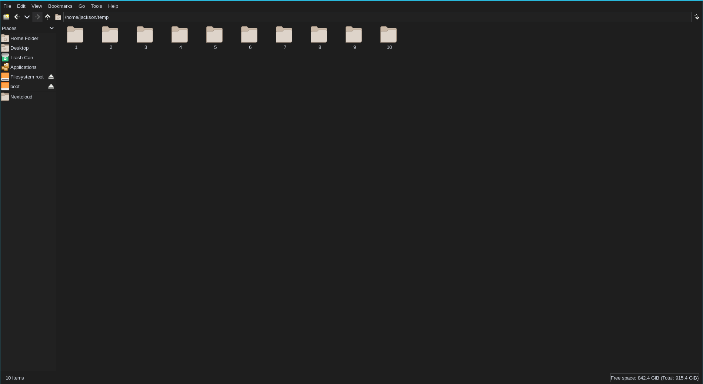

# The NVCode flagship theme inspired color scheme

All of the colors in the theme are based on the [NVCode](https://github.com/ChristianChiarulli/nvcode/) flagship color scheme. The GTK3 theme is not fully complete but most elements are colored.

# Screenshot of the theme



# Installation

**To install only for your user:**

```sh
mkdir -p ~/.themes
git clone https://github.com/jadecell/nvcode-gtk-theme.git ~/.themes/nvcode-gtk-theme
```

**To install for all users on the system:**

**Note:** the following commands must be ran as the `root` user.

```sh
mkdir -p /usr/share/themes/
git clone https://github.com/jadecell/nvcode-gtk-theme.git /usr/share/theme/nvcode-gtk-theme
```

---

After the theme is insalled, you can now set the theme with any GTK theme setter that you want. If you are using a desktop evironment, you will probably already have one, if you do not have one, I recommend you use `lxappearance` because it is light weight. You can get lxappearance from your package manager.
